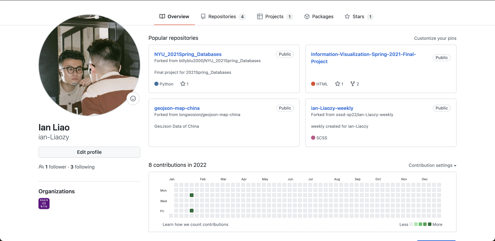

An introduction to open source concept, why are we here for class?(Lecture 1)

Intro to FOSS (Free and Open Source Software); Four Freedoms; More Open Source Definitions.(Lecture 2)

Source: [Intro to FOSS](https://cs.nyu.edu/~joannakl/ossd_s22/slides/introduction.html)

In Week 1, we had an overview of the course Open Source Software Development. We had discussions about the definition of open source, the application of open source project, and the pros & cons of open source ...etc

<!--more-->

**Junior in College while Freshman in Open Source Projects**

Being in college for more than two years, I haven’t really get into a “big” software project. Every time I tried to read the source code of a GitHub project, I would get confused, and don’t know where to start. I feel like there is a significant distance between the knowledge I learnt and the real life practice as a Software Developer.

So, I am taking this class to know more about the open source project, and contribute to some of them. Moreover, I think this experience could help me to be a better Software Developer in the future.

I am not an active [GitHub](https://github.com/ian-Liaozy) user, but I am sure that I will be more active soon!

*](../images/W1BlogP2.png)

Source: *[linkedin.com](http://linkedin.com)*

Representative open source projects

**Open Source in My Opinion**

To me, open source is a great idea for people to share their knowledge and intelligence. Everyone in the community could have access to the source code of an open source project, and are able to contribute to it.

I think the greatest contribution of open source movement is that it narrow the gap of education inequality worldwide. It makes people in different regions of the world have access to some of the best software projects over the world.

**My Open Source Projects Experience**

I used **Visual Studio Code** for a long while before I switched to **JetBrains.** These two open source projects/softwares helps me a lot for coding. From my personal (limited) experience, **VS Code** provides a convenient environment for new comers of coding to switch between different computer languages, and the huge amount of extensions also helps me a lot. **JetBrains’** products such as PyCharm, IntelliJ, and CLion are all-around, and reliable.

For entertainment, I use **Spotify** to listen music. It becomes an open source project at 2020. I used to apply customized themes on Spotify through command line.  

I love to browse **Wikipedia** to enrich my knowledge in many different fields such as history, sociology, and geography. Starting from one page, I can jump to many pages relates to it. 

](../images/W1BlogP3.png)

Source: [https://spotify.github.io/](https://spotify.github.io/)

Spotify’s GitHub page
